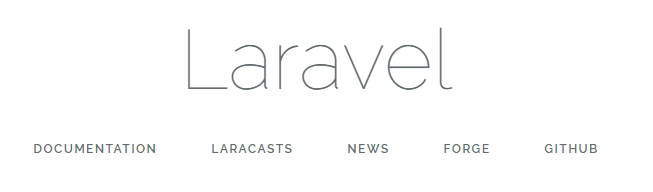
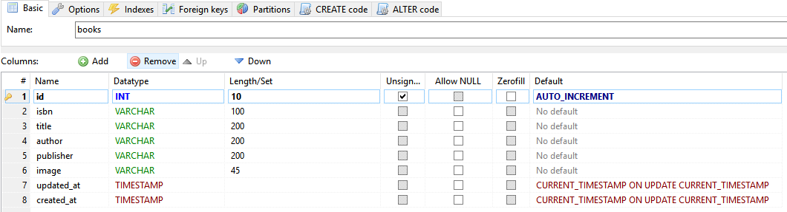
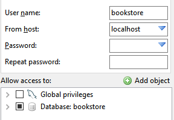
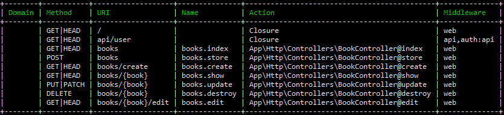
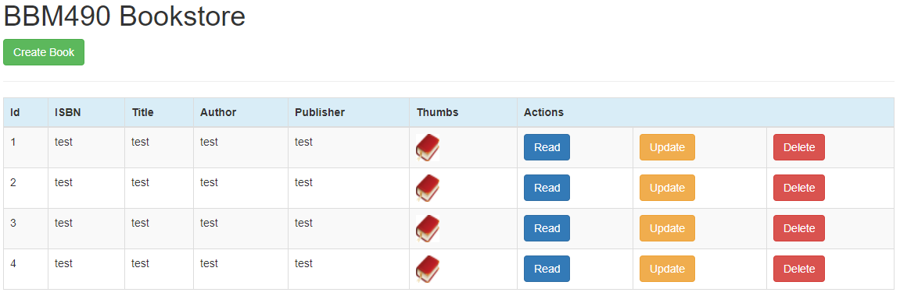
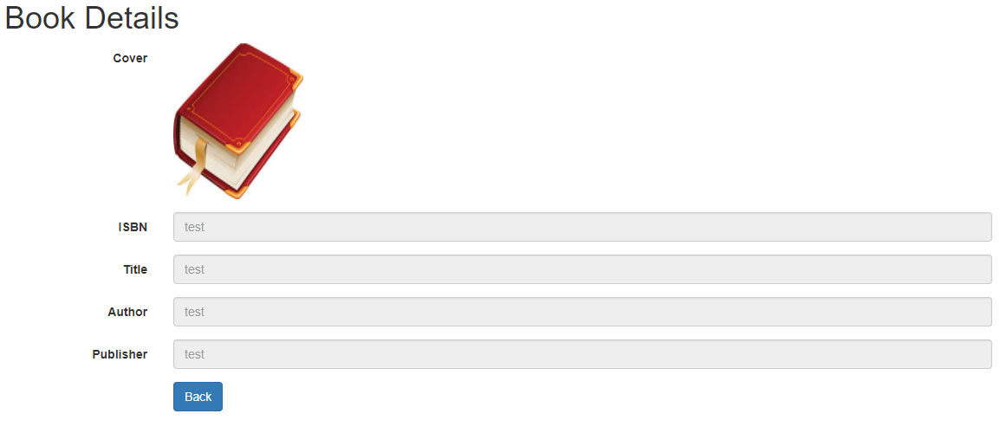
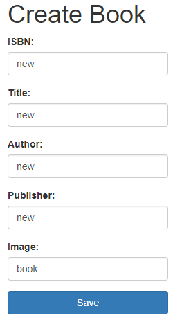
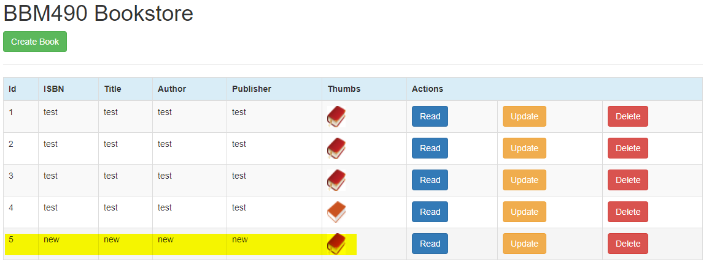
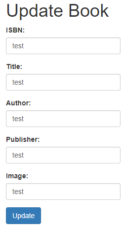
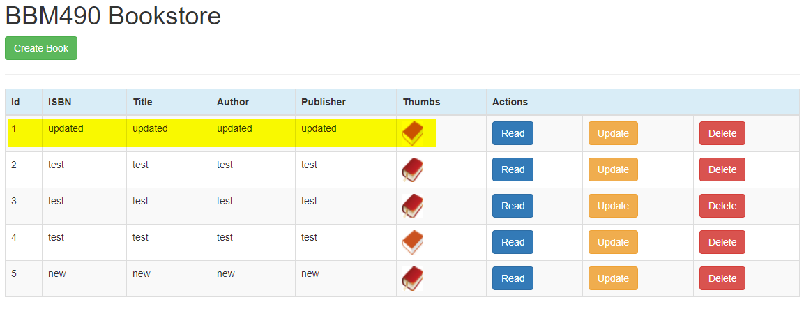

# Laravel Nedir

Laravel, Taylor Otwell tarafından hazırlanan ve MVC mimari desenini takiben web uygulamalarının geliştirilmesi için tasarlanmış, özgür, açık kaynak kodlu bir PHP web çatısıdır. "PHP framework for Web Artisans" slaganı ile yola çıkar. Bağımlılık yöneticisi olan bir paketleme sistemi, çok farklı yollarla ilişkisel veri tabanı bağlantıları kurması ve uygulama bakımı ve dağıtımına yardımcı araçları ile öne çıkar.

### Neden Laravel

Laravel öğrenmesi en kolay olan çatılardandır ve başlamanıza yardımcı olması için birçok çevrimiçi öğretici bulabilirsiniz. Laravel dokümantasyonuna [laravel.com/docs](https://laravel.com/docs/) adresinden ulaşabilirsiniz. Laravel ile yapılmış sayfalar ise [builtwithlaravel.com](http://builtwithlaravel.com/) adresinden ulaşabilirsiniz.

Uzantılar ve paketler söz konusu olduğunda laravel çok öndedir. Laravel paketlerinin bir dizini olan Packalyst, 9.000'den fazla paket sunuyor. Composer kullanarak çok hızlı kurulum yapılabilir. Tonlarca paket ile framework kullanılabilirliğini genişletebilirsiniz.

Blade template ile diğer template sistemlerinin aksine, görünümlerde PHP kodunu kullanmanıza izin verir. Ayrıca, Blade'in uygulama performansı için sıfır yükü vardır çünkü blade görünümü dosyaları .blade.php uzantısında saklandığından, görünüm dosyalarındaki tüm kodlar, işleme sırasında raw PHP'ye dönüştürülür.

Laravel Eloquent ORM kullanır. En gelişmiş Active Record uygulamasıdır. Bizi çok uzun tanımlamalar ve sql sorgularından kurtarır ayrıca yönetmeyi kolaylaştırır. Microsoft BI, MongoDB, MySQL, PostgreSQL, Redis, SQLite gibi veritabalanlarını da destekler.

Müthiş bir route (yönlendirme) mekanizması vardır. Yorulmadan temiz URL elde eder, API'ler için uygun erişim yönlendirmeleri yapabilirsiniz.

Full-Stack frameworktür. Front-end ten back-end'e tüm desteği sunar.

Açık kaynaktır ve kaynak kodları GitHub'da bulunabilir, bu da herkesin katkıda bulunmasını kolaylaştırır. [GitHub/Laravel](https://github.com/laravel/laravel)

# Laravel 5 CRUD MySQL

[Tutorial projesine github repo'dan ulaşabilirsiniz](https://github.com/ozcberkay/Laravel-5-CRUD-MySQL)

Tutorialde, kitapçı envanteri uygulaması yazacağız. Sisteminizde **PHP**, **MySQL**, **Composer** yüklü, ve configuration (PDO-MySQL,  SSL) yapılmış varsayılacaktır.

### 1. Composer ile Laravel projesi oluşturulur

Aşağıdaki komutla *bookstore* isimli Laravel projesi oluşturulur

`composer create-project laravel/laravel bookstore --prefer-dist`


`composer update` komutu ile dependencyler yüklenir/güncellenir

### 2. Proje klasörüne gidip proje çalıştırılır

```powershell
cd bookstore
php artisan serve
```

İnternet tarayıcısından `localhost:8000` adresine gidildiğinde aşağıdaki gibi bir sayfa açılmalıdır.



### 3. MySQL veritabanı oluşturulur

*HeidiSQL* ile, `bookstore` adlı bir veritabanı oluşturup `books` ismindeki tabloyu aşağıdaki gibi oluşturacağız. **Eloquent** için `updated_at` ve `created_at` sütunları gereklidir.



Ardından, güvenlik için, sadece `bookstore` veritabanına `GRANT` harici erişim izni vereceğimiz, `bookstore` MySQL kullanıcısını oluşturacağız.



### 4. MySQL veritabanı ile Laravel projesi bağlanır

Uygulamamızın ana dizinindeki `.env` dosyasında aşağıdaki alanlarda değişiklikleri yapacağız:

```
APP_NAME=bookstore

DB_CONNECTION=mysql
DB_HOST=127.0.0.1
DB_PORT=3306
DB_DATABASE=bookstore
DB_USERNAME=bookstore
DB_PASSWORD=password
```

### 5. Book Controller Oluşturulması

Projenin ana dizinindeyken aşağıdaki komutu çalıştırıp, `BookController` oluşturacağız.

`php artisan make:controller BookController`

Komutu çalıştırdıktan sonra, `bookstore/app/Http/Controllers/BookController.php` dosyasının oluştuğunu göreceğiz. O dosyaya aşağıdaki satırları ekleyelim. Henüz implement edilmeyen fonksiyonlara daha sonraki adımlarda geleceğiz.

```php
<?php 
  
namespace App\Http\Controllers;

use App\Http\Requests;
use App\Http\Controllers\Controller;
use Request;

class BookController extends Controller {
   /**
    * Display a listing of the resource.
    *
    * @return Response
    */
   public function index()
   {
      //
   }
   /**
    * Show the form for creating a new resource.
    *
    * @return Response
    */
   public function create()
   {
      //
   }
   /**
    * Store a newly created resource in storage.
    *
    * @return Response
    */
   public function store()
   {
      //
   }
   /**
    * Display the specified resource.
    *
    * @param  int  $id
    * @return Response
    */
   public function show($id)
   {
      //
   }

   /**
    * Show the form for editing the specified resource.
    *
    * @param  int  $id
    * @return Response
    */
   public function edit($id)
   {
      //
   }
   /**
    * Update the specified resource in storage.
    *
    * @param  int  $id
    * @return Response
    */
   public function update($id)
   {
      //
   }
   /**
    * Remove the specified resource from storage.
    *
    * @param  int  $id
    * @return Response
    */
   public function destroy($id)
   {
      //
   }
}
```


### 6. Book Model Oluşturulması

Aşağıdaki komutla `Book` modelini oluşturacağız. Veritabanındaki tablonun 

`php artisan make:model Book`

Komutu çalıştırdıktan sonra, `bookstore/app/Book.php` dosyasının oluştuğunu göreceğiz.

### 7. Form ve HTML Facade yüklenmesi

Aşağıdaki komutla *facade*leri yüklüyoruz.

`composer require laravelcollective/html`

Ardından `config/app.php` içindeki ilgili array'lara aşağıdaki satırları ekliyoruz:

``` php
  'providers' => [
    // ...
    Collective\Html\HtmlServiceProvider::class,
    // ...
  ],
  'aliases' => [
    // ...
      'Form' => Collective\Html\FormFacade::class,
      'Html' => Collective\Html\HtmlFacade::class,
    // ...
  ],
```

### 8. Restful Controller

`bookstore/routes/web.php` içine `BookController`'i ekliyoruz:

`Route::resource('books','BookController');`

Sonrasında `php artisan route:list` komutu ile, route'ları görüyoruz:



### 9.Layout Oluşturulması

`bookstore/resources/views/layout/template.blade.php` dosyasını oluşturup aşağıdaki kodları yazıyoruz.

```php+HTML
<!doctype html>
<html lang="en">
<head>
<meta charset="UTF-8">
<title>BookStore</title>
<link rel="stylesheet" href="https://maxcdn.bootstrapcdn.com/bootstrap/3.3.4/css/bootstrap.min.css">
</head>
<body>
    <div class="container">
        @yield('content')
    </div>
</body>
</html>
```

### 10. Kitap Listesi

*Eloquent* ile veritabanındaki verilere erişeceğiz. Bunun için *model* tanımımızı `BookController`'a aşağıdaki gibi ekleyeceğiz. Ardından `/books` route'a gelen `GET` request'in davranışını tanımlayan `index()` fonksiyonunu implement edeceğiz. Veritabanındaki tüm dosyaları alıp `books.index` view'ı render edecek.

```php
<?php namespace App\Http\Controllers;

use App\Book;
use App\Http\Requests;
use App\Http\Controllers\Controller;
use Request;

class BookController extends Controller {

   /**
    * Display a listing of the resource.
    *
    * @return Response
    */
   public function index()
   {
        $books=Book::all();
        return view('books.index',compact('books'));
    }
```

Kitap listesini görüntülemek için *view* oluşturacağız. `bookstore/resources/views/books/index.blade.php` dosyasını oluşturup aşağıdaki kodları ekleyelim:

```php+HTML
@extends('layout/template')

@section('content')
 <h1>BBM490 Bookstore</h1>
 <a href="{{url('/books/create')}}" class="btn btn-success">Create Book</a>
 <hr>
 <table class="table table-striped table-bordered table-hover">
     <thead>
     <tr class="bg-info">
         <th>Id</th>
         <th>ISBN</th>
         <th>Title</th>
         <th>Author</th>
         <th>Publisher</th>
         <th>Thumbs</th>
         <th colspan="3">Actions</th>
     </tr>
     </thead>
     <tbody>
     @foreach ($books as $book)
         <tr>
             <td>{{ $book->id }}</td>
             <td>{{ $book->isbn }}</td>
             <td>{{ $book->title }}</td>
             <td>{{ $book->author }}</td>
             <td>{{ $book->publisher }}</td>
             <td>image.'.jpg')}}" height="35" width="30"></td>
             <td><a href="{{url('books',$book->id)}}" class="btn btn-primary">Read</a></td>
             <td><a href="{{route('books.edit',$book->id)}}" class="btn btn-warning">Update</a></td>
             <td>
             {!! Form::open(['method' => 'DELETE', 'route'=>['books.destroy', $book->id]]) !!}
             {!! Form::submit('Delete', ['class' => 'btn btn-danger']) !!}
             {!! Form::close() !!}
             </td>
         </tr>
     @endforeach

     </tbody>

 </table>
@endsection
```

`http://localhost:8000/books` adresine gittiğimizde, veritabanına eklediğimiz verileri göreceğiz:



### 11. Read Book

Read işlevi için `bookstore/resources/views/books/show.blade.php` dosyasını oluşturuyoruz:

```php+HTML
@extends('layout/template')
@section('content')
    <h1>Book Details</h1>

    <form class="form-horizontal">
        <div class="form-group">
            <label for="image" class="col-sm-2 control-label">Cover</label>
            <div class="col-sm-10">
                image.'.jpg')}}" height="180" width="150" class="img-rounded">
            </div>
        </div>
        <div class="form-group">
            <label for="isbn" class="col-sm-2 control-label">ISBN</label>
            <div class="col-sm-10">
                <input type="text" class="form-control" id="isbn" placeholder={{$book->isbn}} readonly>
            </div>
        </div>
        <div class="form-group">
            <label for="title" class="col-sm-2 control-label">Title</label>
            <div class="col-sm-10">
                <input type="text" class="form-control" id="title" placeholder={{$book->title}} readonly>
            </div>
        </div>
        <div class="form-group">
            <label for="author" class="col-sm-2 control-label">Author</label>
            <div class="col-sm-10">
                <input type="text" class="form-control" id="author" placeholder={{$book->author}} readonly>
            </div>
        </div>
        <div class="form-group">
            <label for="publisher" class="col-sm-2 control-label">Publisher</label>
            <div class="col-sm-10">
                <input type="text" class="form-control" id="publisher" placeholder={{$book->publisher}} readonly>
            </div>
        </div>

        <div class="form-group">
            <div class="col-sm-offset-2 col-sm-10">
                <a href="{{ url('books')}}" class="btn btn-primary">Back</a>
            </div>
        </div>
    </form>
@stop
```

Ardından `app/Http/Controllers/BookController.php` dosyasında, id ile MySQL'den veri almak için aşağıdaki fonksiyonu implement ediyoruz:

```php
public function show($id)
{
   $book=Book::find($id);
   return view('books.show',compact('book'));
}
```

`/books`URL'indeki tablodan, herhangi bir kitabın *Read* butonuna bastığımızda, `/books/{id}` URL'ine yönlenecek, ve aşağıdaki gibi bir sayfa göreceğiz:



### 12. Create Book

*Read book* adımında yaptığımız gibi Create işlevi için `bookstore/resources/views/books/create.blade.php` dosyasını oluşturuyoruz:

```php+HTML
@extends('layout.template')
@section('content')
    <h1>Create Book</h1>
    {!! Form::open(['url' => 'books']) !!}
    <div class="form-group">
        {!! Form::label('ISBN', 'ISBN:') !!}
        {!! Form::text('isbn',null,['class'=>'form-control']) !!}
    </div>
    <div class="form-group">
        {!! Form::label('Title', 'Title:') !!}
        {!! Form::text('title',null,['class'=>'form-control']) !!}
    </div>
    <div class="form-group">
        {!! Form::label('Author', 'Author:') !!}
        {!! Form::text('author',null,['class'=>'form-control']) !!}
    </div>
    <div class="form-group">
        {!! Form::label('Publisher', 'Publisher:') !!}
        {!! Form::text('publisher',null,['class'=>'form-control']) !!}
    </div>
    <div class="form-group">
        {!! Form::label('Image', 'Image:') !!}
        {!! Form::text('image',null,['class'=>'form-control']) !!}
    </div>
    <div class="form-group">
        {!! Form::submit('Save', ['class' => 'btn btn-primary form-control']) !!}
    </div>
    {!! Form::close() !!}
@stop
```

Ardından `app/Http/Controllers/BookController.php` dosyasında, `/books/create` URL'ine gidildiğinde, oluşturduğumuz *Blade* template'ini render etmesi için `create()` fonksiyonunu, ve yeni kayıtın veritabanında saklanması için `store()` fonksiyonunu aşağıdaki gibi implement ediyoruz:

```php
/**
    * Show the form for creating a new resource.
    *
    * @return Response
*/
public function create()
{
  return view('books.create');
}

/**
	 * Store a newly created resource in storage.
	 *
	 * @return Response
*/
public function store()
{
  $book=Request::all();
  Book::create($book);
  return redirect('books');
}
```

`Book` modeline, create işlevinde kullanacağımız sütunları aşağıdaki gibi ekliyoruz:

```php
<?php

namespace App;

use Illuminate\Database\Eloquent\Model;

class Book extends Model
{
    protected $fillable=[
        'isbn',
        'title',
        'author',
        'publisher',
        'image'
    ];
}
```

Test etmek için, *Create Book* butonuna basıp, aşağıdaki verileri girdik. `/public/img` dizinindeki jpg uzantılı dosya, kitap resmi olarak kaydediliyor.



*Save* butonuna bastığımızda `/books` URL'ine yönlendirildik, ve eklediğimiz kitabı listede görebiliyoruz:



### 13. Update Book

Update işlevi için `bookstore/resources/views/books/edit.blade.php` dosyasını oluşturuyoruz:

```php+HTML
@extends('layout.template')
@section('content')
    <h1>Update Book</h1>
    {!! Form::model($book,['method' => 'PATCH','route'=>['books.update',$book->id]]) !!}
    <div class="form-group">
        {!! Form::label('ISBN', 'ISBN:') !!}
        {!! Form::text('isbn',null,['class'=>'form-control']) !!}
    </div>
    <div class="form-group">
        {!! Form::label('Title', 'Title:') !!}
        {!! Form::text('title',null,['class'=>'form-control']) !!}
    </div>
    <div class="form-group">
        {!! Form::label('Author', 'Author:') !!}
        {!! Form::text('author',null,['class'=>'form-control']) !!}
    </div>
    <div class="form-group">
        {!! Form::label('Publisher', 'Publisher:') !!}
        {!! Form::text('publisher',null,['class'=>'form-control']) !!}
    </div>
    <div class="form-group">
        {!! Form::label('Image', 'Image:') !!}
        {!! Form::text('image',null,['class'=>'form-control']) !!}
    </div>
    <div class="form-group">
        {!! Form::submit('Update', ['class' => 'btn btn-primary']) !!}
    </div>
    {!! Form::close() !!}
@stop
```

Ardından `app/Http/Controllers/BookController.php` dosyasında, `/books/{id}/edit` URL'ine gidildiğinde, id'si verilmiş kayıt ile, oluşturduğumuz *Blade* template'ini render etmesi için `edit($id)` fonksiyonunu, ve kayıtın veritabanında güncellenmesi için `update($id)` fonksiyonunu aşağıdaki gibi implement ediyoruz:

```php
/**
    * Show the form for editing the specified resource.
    *
    * @param  int  $id
    * @return Response
*/
public function edit($id)
{
   $book=Book::find($id);
   return view('books.edit',compact('book'));
}

/**
 * Update the specified resource in storage.
 *
 * @param  int  $id
 * @return Response
 */
public function update($id)
{
   $bookUpdate=Request::all();
   $book=Book::find($id);
   $book->update($bookUpdate);
   return redirect('books');
}
```

`/books` URL'indeki tablodan, herhangi bir kitabın *Update*butonuna bastığımızda, `/books/{id}/edit` URL'ine yönlenecek, ve aşağıdaki gibi bir sayfa göreceğiz:



ID'si **1** olan kayıdın değerlerini değiştirip Update'a bastığımızda güncellendiğini görüyoruz:



### 14. Delete Book

**CRUD** işlevlerinin sonuncusu *Delete* için, `BookController`'daki `destroy` fonksiyonunu aşağıdaki gibi implement ediyoruz:

```php
/**
* Remove the specified resource from storage.
*
* @param  int  $id
* @return Response
*/
public function destroy($id)
{
   Book::find($id)->delete();
   return redirect('books');
}
```

Delete butonuna basıldığında ilgili kayıt silinecektir.